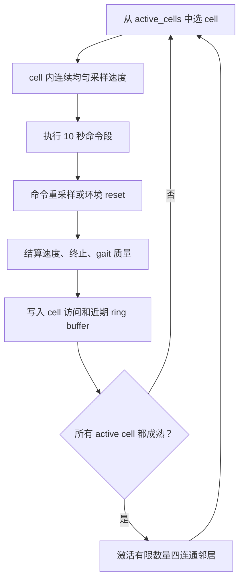

# Grid Adaptive：启发式网格速度指令采样设计

本文描述 Nazarite-mjlab 当前的 `GridAdaptiveVelocityCommand`。它替代“从完整速度范围直接均匀采样”的固定课程，以机器人在局部速度区域的实际成功率驱动难度扩展。

对应文件：

```text
Train/Nazarite/Nazarite-src/nazarite/
├── mdp/commands.py
├── config/train_config/base_env_cfg.py
└── mdp/wtw_rewards.py                 # WTW 模式下与 Grid 共用接触时序语义
```

## 1. 核心目标

普通速度命令一次覆盖整个范围，训练早期会经常采到难速度；而且“某段速度究竟学会没有”无法直接回答。Grid Adaptive 的做法是：

```text
完整速度空间
  -> 离散为若干 cell
  -> 只从 active cell 采样
  -> 对每段命令结算成功/失败
  -> 达到访问量和近期成功率后激活相邻 cell
```

所有并行环境共享一张课程地图，但每个环境独立持有当前 cell 与连续速度命令。



## 2. cell 的采样概率

当前实现不是优先采样失败 cell，而是对所有 active cell 等概率：

```python
active_ids = torch.nonzero(self.active_cells.flatten()).flatten()
selected = active_ids[torch.randint(len(active_ids), (len(env_ids),))]
```

因此：

```text
P(cell_i) = 1 / N_active
```

选中 cell 后，在 cell 的上下边界内连续均匀采样 `lin_vel_x` 与 `ang_vel_z`；横向速度 `lin_vel_y` 不参与网格划分，但依然按配置范围独立采样。

这保证课程不会因为“容易 cell 采样更多”而掩盖困难区域，也使 cell 的成功率具有明确比较意义。

## 3. 当前两类任务配置

`make_base_env_cfg()` 的 baseline 与 WTW 使用同一套命令类，但配置目的不同。

| 参数 | baseline `Nazarite-Velocity-Flat-Go2` | 当前 WTW Trot |
|---|---|---|
| `lin_vel_x` | `[-1.0, 1.0]` | `[-1.0, 1.0]` |
| `lin_vel_y` | `[0, 0]` | `[0, 0]` |
| `ang_vel_z` | `[-0.5, 0.5]` | `[0, 0]` |
| grid | `9 × 7` | `3 × 1` |
| 初始 cell | `(3, 3)` | `(1, 0)` |
| 命令时长 | `10–20 s` | `10 s` |
| 站立比例 | `0.3` | `0.0` |
| `min_cell_visits` / window | `100 / 100` | `8192 / 8192` |
| strict frontier | 否 | 是 |

WTW 当前三格的真实区间为：

```text
cell 0: [-1.000, -0.333] m/s
cell 1: [-0.333,  0.333] m/s  <- 起点
cell 2: [ 0.333,  1.000] m/s
```

`grid_num_yaw=1` 且 yaw 范围为 `(0, 0)` 是有效设计，表示此阶段故意只训练直线 Trot。它不是“缺少第二维网格”的错误。

## 4. 命令段生命周期

每次 reset 或命令定时器到期都会执行：

1. 先结算旧命令段；
2. 从 active cell 等概率选择一个；
3. 在该 cell 内采样连续速度；
4. 清零当前段的速度误差、yaw 误差、gait 误差和步数累计；
5. 执行到下次结算。

每个仿真步中，命令类累积：

```text
_segment_error_xy
_segment_error_yaw
_segment_gait_schedule_error
_segment_gait_sync_error
_segment_gait_mixed_contact
_segment_steps
```

只在段结束时求平均并记录一次成败。这样成功率描述的是“这段命令是否完成”，而不是把每个控制步当成独立样本。

## 5. 成功判定

基础成功条件：

```text
未提前终止
且平均线速度误差 <= velocity_error_threshold
且平均 yaw 误差 <= yaw_error_threshold
```

当前 WTW 还额外启用 gait-aware gate：

```text
平均接触时序误差 <= 0.16
平均同步误差 <= 0.08             # 仅同步 gait 才有实际含义
平均混合接触比例 <= 0.12           # 仅同步 gait 才有实际含义
```

这些阈值与 `wtw_rewards.py` 的平滑接触目标共享同一套 `duty_factor` 和 `smoothing=0.07` 语义，避免发生“reward 认为正确、课程却认为错误”的双重定义。

当前 Trot 不要求四脚同步，故 `grid_gait_sync_error` 和 `grid_gait_mixed_contact` 通常为 0；真正应查看的是 `grid_gait_schedule_error`。

## 6. 近期窗口、累计统计和 strict frontier

每个 cell 保存三组概念不同的数据：

| 数据 | 用处 |
|---|---|
| `cell_visits` / `cell_successes` | 从训练开始至今的累计记录，适合回顾。 |
| `cell_success_history` | 每 cell 独立环形缓冲区。 |
| `cell_recent_visits` / `cell_recent_successes` | 最近窗口内的成熟度，决定扩展。 |

WTW 的扩展条件是：

```text
累计访问 >= 8192
最近访问 >= 8192
最近成功率 >= 0.8
```

并且 `require_all_active_cells_ready=True`：只要有一个已激活 cell 未成熟，任何成熟 cell 都不能扩展新邻居。这会让激活顺序清楚地呈现为 `1 → 2 → 3`，适合当前单 gait 的严格验证。

`grid_active_cells` 偶尔在切换 iter 显示 `2.3125` 一类小数，是不同并行环境 reset 时日志按环境平均的瞬时结果，不表示课程真的启用了“0.3125 个 cell”。检查 checkpoint 的 `active_cells` 或其后稳定值即可。

## 7. 站立命令的处理

baseline 有 `rel_standing_envs=0.3`，会将一些环境的三维速度命令置为零；这些样本不计入速度 Grid 成功率，避免大量容易的站立成功虚高普通速度 cell。

当前 WTW Trot 配置为 `rel_standing_envs=0.0`，因为本轮目标是先验证移动 gait；phase 的冻结逻辑仍然存在，以保证 play 中将速度手动设为零时进入站立。

若之后想将“刹停/静止”作为显式训练能力，应另行开启站立采样，并结合 `stand_pose` 与可控强度的 `zero_command_stillness`，而不是把零速度段混进移动 cell 的成功统计。

## 8. checkpoint 保存与恢复

Grid 的状态会随 runner checkpoint 写入，包括：

```text
active_cells
cell_visits / cell_successes
近期成功 ring buffer、指针、近期计数
每个环境当前 cell、当前速度、命令计时器
当前命令段的误差累计
```

因此正常 resume 会继续同一张课程地图，不会回到只激活中间 cell 的起点。分析旧训练必须读取该 run 的 `params/env.yaml` 与 checkpoint 状态；当前源码默认值可能已经改变。

## 9. TensorBoard 与检查顺序

最小检查集合：

```text
Metrics/twist/grid_active_cells
Metrics/twist/grid_total_visits
Metrics/twist/grid_success
Metrics/twist/grid_error_vel_xy
Metrics/twist/grid_gait_schedule_error     # WTW 时必看
```

对当前 Trot：

1. `grid_active_cells` 是否从 1 串行到 3；
2. `grid_success` 后期是否持续高于 0.8；
3. `grid_error_vel_xy` 是否低于 0.25；
4. `grid_gait_schedule_error` 是否低于 0.16；
5. 再结合 `WTW/contact_schedule_error`、高度和终止日志判断是否为真正稳定 gait。

不要只根据 `Train/mean_reward` 判断课程质量。它可能上升，但中间 cell 的近期成功率仍不足，或高度、接触时序已经退化。

## 10. 当前建议

当前 Trot 已先验证固定频率，又进行了 `2–3 Hz` 的历史宽频试验。后者的速度和 schedule 指标良好，但出现机体高度上漂。因此源码默认保守设为 `2.0–2.4 Hz`，下一轮应先验证这个小范围，而不要同时扩大速度 Grid、频率、姿态行为和域随机化。

更多 WTW 行为与奖励说明见：[WTW 从零手写 Walk These Ways](WTW-从零手写Walk-These-Ways.md) 与 [WTW 奖励调参详细使用指南](WTW奖励调参详细使用指南.md)。
