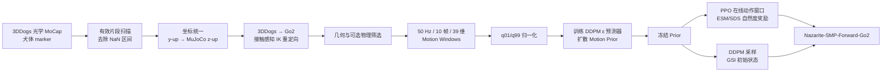
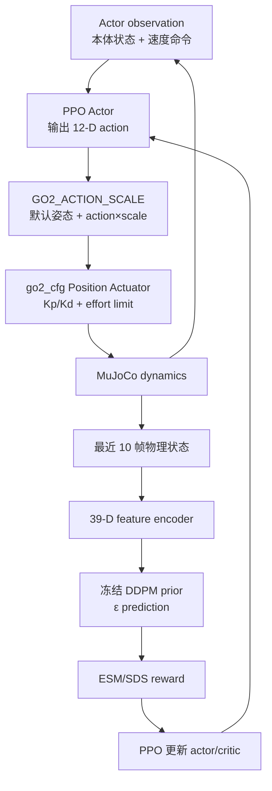

# Nazarite-mjlab：SMP 数据处理、扩散先验与强化学习全链路指南

> 文档状态：2026-09-09，以当前 `Nazarite-mjlab`、本地 `smp-master` 参考仓库和
> 《SMP: Reusable Score-Matching Motion Priors for Physics-Based Character Control》
> 为准。
>
> 所有命令默认从 `Train/Nazarite` 目录执行。`output/`、`tools/smp_dataset/`、
> `logs/` 和模型权重均为本地资产，不应提交到 Git。

## 1. 先看清整个系统在做什么

当前项目的正式 SMP 主链是：



这里有四个容易混淆的概念：

1. **重定向不是训练**：它把真实犬的 marker/四爪轨迹转换为 Go2 的 root 和
   12 个关节角参考轨迹。
2. **教师策略不是扩散模型**：教师是 PPO reference tracker；扩散 prior 是
   DDPM 去噪网络。
3. **Score Matching 训练的是动作扩散 prior**：它不直接修改 Go2 执行器，也
   不是下游策略的动作输出模型。
4. **下游在线执行的仍是普通 PPO 策略**：扩散 prior 只在训练期间提供奖励和
   GSI 初始状态；部署时只需要 actor。

论文原始方法不要求先训练 tracking teacher。当前项目的正式 1× prior 数据也
直接来自经过筛选的几何重定向轨迹。教师环境是一条可选的“物理闭环精炼”支线，
不是进入 SMP 的硬性前置步骤。

---

## 2. 当前目录和数据资产约定

### 2.1 源码目录

```text
Train/Nazarite/
├── tools/
│   ├── smp_tools/                     # 可提交的离线工具源码
│   │   ├── data/                      # 读取、扫描、MoCap 动画
│   │   ├── coordinates/               # 3DDogs → MuJoCo 坐标验证
│   │   ├── retargeting/               # Go2 IK 重定向
│   │   ├── quality/                   # 几何质量与候选比较
│   │   ├── physics/                   # 开环物理回放和失效分析
│   │   ├── preprocessing/             # 降速、平滑单片段
│   │   ├── dataset/                   # 批处理和数据集验收
│   │   ├── prior/                     # motion windows、统计、prior 验收
│   │   └── teacher/                   # 教师闭环 rollout 导出
│   └── smp_dataset/                   # 本地数据与 prior；整目录 Git ignored
├── Nazarite-src/nazarite/config/
│   ├── robot_config/go2_cfg.py        # 实际执行器、action scale、初始姿态
│   └── train_config/
│       ├── smp_config/                # 教师与 SMP Forward 环境/PPO 配置
│       └── train_algorithm/smp/
│           ├── prior/                 # DDPM、特征、SDS、GSI
│           └── teacher/               # reference command、观测、奖励、终止
├── output/                            # 可删除的处理过程与验收产物
└── logs/                              # PPO checkpoint、TensorBoard、W&B 记录
```

### 2.2 推荐的数据集目录

每个可复用数据集使用独立名字：

```text
tools/smp_dataset/<dataset-name>/
├── raw/                               # 可选：实际用到的原始 trial 子集
├── manifests/
│   ├── scan/
│   │   ├── all_valid_runs.csv
│   │   ├── selected_clips.csv
│   │   └── scan_summary.json
│   ├── accepted_manifest.json
│   └── dataset_report.json
├── processed/
│   ├── retargeted/                    # 可选：验收通过的 Go2 参考
│   └── motion_windows/                # prior 训练的直接输入
└── statistics/
    ├── norm_stats.npz
    ├── norm_stats.json
    └── motion_dataset_audit.json
```

所有 prior 固定放在：

```text
tools/smp_dataset/smp_prior/<prior-name>/
├── pretrained.pt                      # 下游任务读取的稳定版
└── <timestamp>/
    ├── checkpoint_00000.pt
    ├── checkpoint_00100.pt
    ├── ...
    ├── pretrained.pt
    ├── config.json
    └── metrics.json
```

### 2.3 建议先定义本次构建路径

```bash
cd /home/haozi/桌面/Nazarite-mjlab/Train/Nazarite

export SMP_SOURCE_DIR=/home/haozi/3DDogs/3DDogs2024_full/Data/Optical/Sync_Align_v2023_11_16b
export SMP_DATASET_NAME=3ddogs_go2_1x_v2
export SMP_BUILD_DIR=output/smp_build/${SMP_DATASET_NAME}
export SMP_ASSET_DIR=tools/smp_dataset/${SMP_DATASET_NAME}
```

`SMP_BUILD_DIR` 是可删除的工作区；`SMP_ASSET_DIR` 是长期保留但不提交的本地
数据资产目录。

---

## 3. 上游数据必须满足什么条件

当前读取器针对 3DDogs Optical 数据：

```text
optical_sync_align_d*_t*_*.txt
```

文件要求：

- 第一行包含 `fps`，当前 3DDogs Optical 通常是 60 Hz；
- 第四行从 `frame_num` 开始，后面是 marker 名称；
- 每帧为 `frame_num + marker_0_xyz + marker_1_xyz + ...`；
- 缺失 marker 必须保留为 `NaN`，不能填成 `(0, 0, 0)`；
- 至少包含 root 和四爪所需 marker。

工具固定使用以下语义：

| 语义 | 3DDogs marker |
| --- | --- |
| 前躯/后躯 | `withers`, `sacrum` |
| 左右肩 | `l_shdr`, `r_shdr` |
| 左右髋 | `l_iliac`, `r_iliac` |
| FL / FR | `l_meta_carp`, `r_meta_carp` |
| RL / RR | `l_meta_tars`, `r_meta_tars` |

整个项目的腿顺序固定为：

```text
FL, FR, RL, RR
```

关节顺序固定为每条腿的：

```text
hip, thigh, calf
```

如果将来换成别的真实动物数据集，不能直接运行 3DDogs 读取器。需要先写 adapter，
把新数据映射为与 `retarget_inputs_mujoco.npz` 相同的 canonical schema：

```text
frame_numbers          [T]
root_pos_mujoco        [T, 3]
root_forward_mujoco    [T, 3]
root_left_mujoco       [T, 3]
root_up_mujoco         [T, 3]
paw_pos_mujoco         [T, 4, 3]
fps                    scalar
paw_order              [4] = FL, FR, RL, RR
axis_map                scalar string
```

---

## 4. 3DDogs 数据处理：逐步执行、逐步验收

### 4.1 单 trial 只读检查

目的：确认文件能解析、marker 名称正确、NaN 比例和连续有效区间合理。

```bash
uv run python tools/smp_tools/data/inspect_3ddogs.py \
  --input "${SMP_SOURCE_DIR}/optical_sync_align_d19_t1_a.txt" \
  --output-dir "${SMP_BUILD_DIR}/inspect/d19_t1_a" \
  --plot
```

输出：

```text
${SMP_BUILD_DIR}/inspect/d19_t1_a/
├── retarget_inputs_raw.npz   # 原始坐标；root、四爪、marker、valid_mask
├── summary.json              # fps、marker 列表、valid_runs
└── raw_trajectories.png      # 原始坐标下的 root/四爪静态轨迹
```

`retarget_inputs_raw.npz` 只是审计中间件，不是 Go2 训练数据；它故意没有做
y-up → z-up 坐标转换。

重点看 `summary.json`：

- `valid_fraction`：所有必需 marker 同时有效的帧比例；
- `valid_runs`：后续可截取的连续区间；
- `start_index` / `end_index_exclusive`：是数组索引，不一定等于采集 frame 编号。

### 4.2 全量扫描并生成片段 manifest

```bash
uv run python tools/smp_tools/data/scan_3ddogs.py \
  --input-dir "${SMP_SOURCE_DIR}" \
  --output-dir "${SMP_BUILD_DIR}/scan" \
  --min-duration-s 0.5
```

输出：

```text
${SMP_BUILD_DIR}/scan/
├── all_valid_runs.csv        # 所有连续有效区间
├── selected_clips.csv        # 达到最短时长的候选区间
└── scan_summary.json         # 总文件数、失败数、候选数量和总时长
```

`selected_clips.csv` 是 `build_reference_dataset.py` 的直接输入。它包含源文件
绝对路径、trial 名称、起止索引、帧数和时长。

0.5 秒是当前小数据集采用的门槛，只适合先打通流程。正式 locomotion prior 更
适合优先保留 1～2 秒以上且包含完整步态周期的片段，并扩充总时长和动作多样性。

### 4.3 生成真实犬 marker 骨架动画

```bash
uv run python tools/smp_tools/data/visualize_3ddogs_mocap.py \
  --input "${SMP_SOURCE_DIR}/optical_sync_align_d29_t1_a.txt" \
  --start-index 0 \
  --end-index 132 \
  --coordinate-frame mujoco \
  --camera-mode follow \
  --output "${SMP_BUILD_DIR}/visualizations/d29_t1_a_mujoco.gif"
```

输出文件名完全由 `--output` 决定，可以是 `.gif` 或 `.mp4`。这是 marker 和
骨架诊断动画，不是犬 mesh，也不是 Go2 物理回放。

检查：

- FL/FR/RL/RR 是否没有交换；
- 动物是否沿预期方向移动；
- 地面高度和抬腿方向是否正确；
- 是否存在 marker 跳变、长时间缺失或不自然瞬移。

### 4.4 显式验证 y-up → MuJoCo z-up

```bash
uv run python tools/smp_tools/coordinates/validate_3ddogs_coordinates.py \
  --input "${SMP_SOURCE_DIR}/optical_sync_align_d29_t1_a.txt" \
  --start-index 0 \
  --end-index 132 \
  --axis-map neg_x_z_y \
  --output-dir "${SMP_BUILD_DIR}/coordinate_validation/d29_t1_a" \
  --plot
```

输出：

```text
${SMP_BUILD_DIR}/coordinate_validation/d29_t1_a/
├── retarget_inputs_mujoco.npz
├── coordinate_report.json
└── coordinate_diagnostics.png
```

当前批处理使用的右手系映射是 `neg_x_z_y`：目标约定为 MuJoCo `+x` 前、`+y`
左、`+z` 上。`coordinate_report.json` 仍标记
`manual_acceptance_required=true`，因此第一次换狗、换采集批次或换数据集时必须
人工看图确认。

重定向时还要保持 root 平移和 root 姿态使用同一个初始身体坐标系。当前工具会把
`root_pos_mujoco - root_pos_mujoco[0]` 旋转到第一帧犬身体坐标，再与相对初始帧的
Go2 root quaternion 一起输出。否则不同初始朝向的片段会在 Motion Window 中产生
假的正/负 `root_lin_vel.x`，看起来像后退动作，但原始犬可能一直在向前走。

可用以下工具按犬的解剖学前向速度分类片段：

```bash
uv run python tools/smp_tools/data/classify_3ddogs_clips.py \
  --manifest "${SMP_BUILD_DIR}/scan/selected_clips.csv" \
  --output-dir "${SMP_BUILD_DIR}/classification" \
  --deadband 0.3
```

它生成 `direction_behavior_manifest.json`、`all_classified_clips.csv` 和按类别划分
的 CSV；该审计不替代后续视觉和 MuJoCo 物理验收。

### 4.5 审计 Go2 模型、关节和足端顺序

```bash
uv run python tools/smp_tools/retargeting/inspect_go2_kinematics.py \
  --output-dir "${SMP_BUILD_DIR}/go2_kinematics" \
  --plot
```

输出：

```text
${SMP_BUILD_DIR}/go2_kinematics/
├── go2_kinematics_report.json
└── go2_default_stance.png
```

报告记录 XML 的 `nq/nv/nu`、关节地址、硬限位、actuator 顺序、四个 hip/foot
位置和 Nazarite 默认姿态。XML 在这里提供机器人几何和硬限位；真正训练用的
执行器会先删除 XML actuator，再由 `go2_cfg.py` 重建。

### 4.6 批量 canonical、重定向、质量评估和物理筛选

推荐使用批处理入口，而不是逐个手写命令：

```bash
uv run python tools/smp_tools/dataset/build_reference_dataset.py \
  --manifest "${SMP_BUILD_DIR}/scan/selected_clips.csv" \
  --output-dir "${SMP_BUILD_DIR}/retargeted" \
  --anchor-strength 0.35 \
  --run-physics \
  --kp-scale 1.0 \
  --kd-scale 1.0 \
  --control-decimation 10 \
  --max-action-saturation-fraction 1.0 \
  --min-physics-valid-fraction 0.55 \
  --max-joint-error-rad 0.90
```

对每个 CSV 行，脚本依次执行：

1. 用已验证的 `neg_x_z_y` 写 canonical NPZ；
2. 调用 `high_quality_retarget.py` 做接触感知、有界 DLS IK；
3. 调用 `evaluate_retarget.py` 计算几何质量；
4. 如果有 `--run-physics`，调用实际 Nazarite 执行器做开环 PD 跟踪；
5. 根据阈值写入 accepted/rejected。

输出树：

```text
${SMP_BUILD_DIR}/retargeted/
├── dataset_report.json
├── accepted_manifest.json
└── <trial>_sXXXX_eYYYY/
    ├── canonical/
    │   └── retarget_inputs_mujoco.npz
    └── retarget/
        ├── go2_reference_geometric.npz
        ├── retarget_summary.json
        ├── quality_report.json
        ├── go2_physics_rollout.npz          # 仅 --run-physics
        └── physics_tracking_summary.json    # 仅 --run-physics
```

`go2_reference_geometric.npz` 是后续最重要的中间产物，包含：

```text
qpos, root_pos_mujoco, root_quat_wxyz,
joint_pos_rad, foot_target_world_m, foot_target_base_m,
foot_position_world_m, contact, solver_status, ik_success, fps
```

#### 当前执行器一致性

物理筛选不是直接使用 XML 内原始 actuator。`track_go2_reference_physics.py`
读取 `nazarite.config.robot_config.go2_cfg`，使用：

- `GO2_HIP_ACTUATOR_CFG` / `GO2_CALF_ACTUATOR_CFG`；
- 当前 `GO2_ACTUATOR_KP_SCALE=2.0`、`GO2_ACTUATOR_KD_SCALE=2.0`；
- effort limit 和 armature；
- 原有 `GO2_ACTION_SCALE`；
- `decimation=10`，即 0.002 s 仿真步长下 50 Hz policy 控制。

命令中的 `--kp-scale 1.0 --kd-scale 1.0` 是在 `go2_cfg.py` 当前实际增益上的
额外倍率；保持 1.0 才与训练一致。提高 Kp/Kd 并不会自动改变 action scale。

`equivalent_action_saturation_fraction` 统计“若 action 限制在 [-1,1] 会超限多少”，
但当前 SMP RL 的 `clip_actions=None`，所以它是诊断指标，不是严格物理边界。若用
`0.20` 作为筛选门槛，是数据策略选择，而不是当前控制器必然要求。

#### accepted 判据

批处理固定要求：

- 几何 `valid_fraction >= 0.95`；
- 无关节硬限位违规；
- 若启用物理筛选，再满足命令给出的物理有效率、最大关节误差和 action 诊断阈值。

`dataset_report.json` 保留所有处理结果和拒绝原因；
`accepted_manifest.json` 只包含通过项。

### 4.7 单片段重定向与可视化调试

基线 IK：

```bash
uv run python tools/smp_tools/retargeting/retarget_3ddogs_to_go2.py \
  --input "${SMP_BUILD_DIR}/coordinate_validation/d29_t1_a/retarget_inputs_mujoco.npz" \
  --output-dir "${SMP_BUILD_DIR}/ablation/d29_t1_a_baseline" \
  --plot
```

当前推荐的接触感知重定向：

```bash
uv run python tools/smp_tools/retargeting/high_quality_retarget.py \
  --input "${SMP_BUILD_DIR}/coordinate_validation/d29_t1_a/retarget_inputs_mujoco.npz" \
  --output-dir "${SMP_BUILD_DIR}/ablation/d29_t1_a_anchor035" \
  --contact-anchor-strength 0.35 \
  --plot
```

它借鉴 GQMR 工作台中对动物动作有价值的思路：接触 anchor、有界 DLS 更新、
中值窗口 refinement、失败帧修复和显式 solver status；并没有把 GQMR 整个工程
原样嵌入 Nazarite。

几何 qpos 动画：

```bash
uv run python tools/smp_tools/physics/replay_go2_reference.py \
  --input "${SMP_BUILD_DIR}/ablation/d29_t1_a_anchor035/go2_reference_geometric.npz" \
  --output "${SMP_BUILD_DIR}/ablation/d29_t1_a_anchor035/geometric_replay.gif"
```

注意：`replay_go2_reference.py` 直接赋值 qpos，只验证外观和 FK，不代表执行器能
跟踪。真正物理回放使用：

```bash
uv run python tools/smp_tools/physics/track_go2_reference_physics.py \
  --input "${SMP_BUILD_DIR}/ablation/d29_t1_a_anchor035/go2_reference_geometric.npz" \
  --output-dir "${SMP_BUILD_DIR}/ablation/d29_t1_a_anchor035/physics" \
  --kp-scale 1.0 \
  --kd-scale 1.0 \
  --control-decimation 10 \
  --plot
```

它产生：

```text
go2_physics_rollout.npz
physics_tracking_summary.json
physics_tracking_diagnostics.png
```

如果失败，再运行：

```bash
uv run python tools/smp_tools/physics/analyze_tracking_failure.py \
  --geometric-input "${SMP_BUILD_DIR}/ablation/d29_t1_a_anchor035/go2_reference_geometric.npz" \
  --physics-input "${SMP_BUILD_DIR}/ablation/d29_t1_a_anchor035/physics/go2_physics_rollout.npz" \
  --output-dir "${SMP_BUILD_DIR}/ablation/d29_t1_a_anchor035/failure_analysis" \
  --plot
```

输出 `tracking_failure_report.json` 和 `tracking_diagnosis.png`，用于找出最早超限
时刻、最差关节、base 高度/朝向失效和足端误差。

### 4.8 可选：降速、平滑和教师参考数据

这一步主要为 reference-tracking teacher 服务。**正式 1× prior 不需要先降速。**

```bash
uv run python tools/smp_tools/dataset/preprocess_accepted_dataset.py \
  --accepted-manifest "${SMP_BUILD_DIR}/retargeted/accepted_manifest.json" \
  --output "${SMP_BUILD_DIR}/accepted_manifest_preprocessed.json" \
  --playback-rate 1.0 \
  --smoothing-window 5
```

每个 accepted clip 的 `retarget/` 目录下会新增：

```text
preprocessed_rate_1/
├── go2_reference_preprocessed.npz
└── preprocess_summary.json
```

特殊命名：`playback-rate=0.5` 会使用历史兼容目录
`preprocessed_half_speed/`；其他倍率如 0.75 使用
`preprocessed_rate_0p75/`。

批量脚本指定的 `--output` 会得到一个包含 `clips` 列表的 manifest，每项新增
`preprocessed_npz` 和 `preprocess_summary`。

预处理后必须再次按实际控制器验证：

```bash
uv run python tools/smp_tools/dataset/validate_preprocessed_dataset.py \
  --manifest "${SMP_BUILD_DIR}/accepted_manifest_preprocessed.json" \
  --output-dir "${SMP_BUILD_DIR}/preprocessed_validation" \
  --kp-scale 1.0 \
  --kd-scale 1.0 \
  --control-decimation 10 \
  --max-action-saturation-fraction 1.0 \
  --min-physics-valid-fraction 0.55 \
  --max-joint-error-rad 0.90
```

输出：

```text
${SMP_BUILD_DIR}/preprocessed_validation/
├── <clip-name>/
│   ├── go2_physics_rollout.npz
│   └── physics_tracking_summary.json
├── preprocessed_validation_report.json
└── validated_manifest.json
```

#### 可选教师训练

```bash
uv run train Nazarite-SMP-Teacher-Go2 \
  --gpu-ids '[0]' \
  --env.scene.num-envs 512 \
  --env.commands.reference.motion-file "${SMP_BUILD_DIR}/preprocessed_validation/validated_manifest.json" \
  --agent.max-iterations 15000 \
  --agent.num-steps-per-env 64 \
  --agent.experiment-name go2_smp_reference_teacher \
  --agent.logger wandb
```

`--gpu-ids` 是列表类型，单卡也必须写成 `'[0]'`，不能写 `0`。

教师输出 12 维归一化 action，经 `GO2_ACTION_SCALE` 变成目标关节位置，再由当前
Kp/Kd 执行。它通过 reference joint、foot、root velocity、contact、upright 等
奖励学习动态跟踪。

导出闭环轨迹：

```bash
uv run python tools/smp_tools/teacher/export_teacher_rollouts.py \
  --checkpoint-file logs/rsl_rl/go2_smp_reference_teacher/<run>/model_15000.pt \
  --reference-file "${SMP_BUILD_DIR}/preprocessed_validation/validated_manifest.json" \
  --output-dir "${SMP_BUILD_DIR}/teacher_rollouts/example" \
  --device cuda:0
```

输出：

```text
teacher_rollout.npz
summary.json
```

重要限制：当前 `teacher_rollout.npz` 使用 `root_pos`、`root_ang_vel_b` 等导出键，
而 `build_motion_windows.py` 当前要求 `root_pos_mujoco`、`root_quat_wxyz` 和完整
Go2 `qpos` schema。因此教师 rollout **目前不能直接作为 prior 输入**。若未来要
让 prior 学习教师真实执行轨迹，应先实现专门的 teacher-rollout → motion-window
adapter，并验证它与在线 39 维编码完全一致。

另外，`smp_teacher_env_cfgs.py` 当前默认 reference 仍指向历史 `output/...`
路径。删除 `output/` 后应像上面一样显式传入
`--env.commands.reference.motion-file`，不要依赖默认值。

---

## 5. 生成扩散 prior 直接使用的 Motion Windows

### 5.1 1×几何轨迹分支

当前正式数据采用这一分支：保持原物理时长，把 60 Hz 重定向参考重采样到 Go2
policy 的 50 Hz，不做时间拉伸。

```bash
uv run python tools/smp_tools/prior/build_motion_windows.py \
  --manifest "${SMP_BUILD_DIR}/retargeted/accepted_manifest.json" \
  --source-field geometric_npz \
  --output-dir "${SMP_BUILD_DIR}/motion_windows" \
  --output-fps 50 \
  --window-size 10 \
  --stride 1
```

输出：

```text
${SMP_BUILD_DIR}/motion_windows/
├── <clip-name-1>.npz
├── <clip-name-2>.npz
├── ...
└── motion_window_report.json
```

每个 NPZ 包含：

```text
windows          [N, 10, 39]
fps              50
speed_scale      1.0
window_size      10
stride           1
feature_dims     [3, 6, 12, 12, 3, 3]
feature_names
joint_names
foot_site_names
```

### 5.2 预处理参考分支

如果确实要训练 0.5×、0.75×或经过平滑的 prior，可改为：

```bash
uv run python tools/smp_tools/prior/build_motion_windows.py \
  --manifest "${SMP_BUILD_DIR}/preprocessed_validation/validated_manifest.json" \
  --entries-key clips \
  --source-field preprocessed_npz \
  --output-dir "${SMP_BUILD_DIR}/motion_windows_preprocessed" \
  --output-fps 50 \
  --window-size 10 \
  --stride 1
```

prior 的速度语义由实际输入轨迹决定；目录名、`speed_scale` 元数据或文件名本身
不会替你改变动作速度。

### 5.3 39 维特征是什么

每帧特征为：

| 特征 | 维数 | 含义 |
| --- | ---: | --- |
| `root_pos` | 3 | 以窗口最后帧 root xy 为原点，z 保留绝对高度 |
| `root_rot_6d` | 6 | 去掉最后帧 yaw 后的 root 6D 旋转 |
| `joint_pos` | 12 | Go2 四腿关节角 |
| `foot_pos` | 12 | 四足相对 root、处于最后帧 yaw 坐标系的位置 |
| `root_lin_vel` | 3 | 最后帧 yaw 坐标系下的 root 线速度 |
| `root_ang_vel` | 3 | 最后帧 yaw 坐标系下的 root 角速度 |
| 合计 | 39 | 每个窗口形状为 `[10,39]` |

窗口最后帧的 yaw-only 坐标系消除了世界平移和绝对朝向，使同一种步态出现在不同
场地位置或朝向时仍具有相似表示。四足位置通过 Go2 qpos 的 MuJoCo FK 重新计算，
不是直接把犬 marker 当作 Go2 足端。

离线 `compute_motion_windows()` 和在线 `MotionFeatureBuffer.compute_features()`
必须保持完全同一特征顺序和坐标定义。任何关节顺序、四足顺序、四元数顺序、fps
或局部坐标变更都意味着旧 prior 不再兼容。

### 5.4 计算 q01/q99 归一化

```bash
uv run python tools/smp_tools/prior/compute_norm_stats.py \
  --input-dir "${SMP_BUILD_DIR}/motion_windows" \
  --output "${SMP_BUILD_DIR}/statistics/norm_stats.npz" \
  --q-low 0.01 \
  --q-high 0.99
```

输出：

```text
${SMP_BUILD_DIR}/statistics/
├── norm_stats.npz
└── norm_stats.json
```

归一化公式：

\[
x_{norm}=2\frac{x-q_{01}}{q_{99}-q_{01}}-1
\]

实现不会把数值强行 clip 到 `[-1,1]`；超出训练分位数的状态可以得到绝对值大于
1 的 normalized feature。`q_low/q_high` 会直接打包进 prior checkpoint，RL
阶段必须使用同一组统计。

统计范围过窄会让策略探索时大量落到分布外区域，导致 score 不可靠。当前 18 秒
小数据只能用于第一阶段验证；正式通用 prior 应加入更多犬、速度、步态、转向和
过渡动作。

### 5.5 只读审计 Motion Windows

```bash
uv run python tools/smp_tools/prior/inspect_motion_dataset.py \
  --input-dir "${SMP_BUILD_DIR}/motion_windows" \
  --norm-stats "${SMP_BUILD_DIR}/statistics/norm_stats.npz" \
  --output "${SMP_BUILD_DIR}/statistics/motion_dataset_audit.json"
```

报告检查：

- 所有文件都有 `[N,10,39]` 的 `windows`；
- 所有值有限；
- window size 一致；
- 每维 minimum/maximum/mean/std；
- 归一化后低于 -1、高于 +1 的比例与最大绝对值。

### 5.6 把验收结果固化为本地数据资产

prior 训练真正必需的只有：

```text
processed/motion_windows/*.npz
statistics/norm_stats.npz
```

推荐同时保留 scan、accepted manifest、dataset report 和通过验收的 retargeted
参考，便于追溯。可按以下结构复制：

```bash
mkdir -p "${SMP_ASSET_DIR}/manifests/scan"
mkdir -p "${SMP_ASSET_DIR}/processed/motion_windows"
mkdir -p "${SMP_ASSET_DIR}/statistics"

cp -a "${SMP_BUILD_DIR}/scan/." "${SMP_ASSET_DIR}/manifests/scan/"
cp -a "${SMP_BUILD_DIR}/retargeted/accepted_manifest.json" "${SMP_ASSET_DIR}/manifests/accepted_manifest.json"
cp -a "${SMP_BUILD_DIR}/retargeted/dataset_report.json" "${SMP_ASSET_DIR}/manifests/dataset_report.json"
cp -a "${SMP_BUILD_DIR}/motion_windows/." "${SMP_ASSET_DIR}/processed/motion_windows/"
cp -a "${SMP_BUILD_DIR}/statistics/." "${SMP_ASSET_DIR}/statistics/"
```

`accepted_manifest.json` 和历史报告可能含生成时的绝对路径；复制后它们仍可用于
追溯，但不保证能作为可搬迁的执行 manifest。`smp-pretrain` 只读取最终
motion-window 目录和 norm stats，不依赖这些旧绝对路径。

如果还要在新位置继续 preprocessing/teacher 流程，应重新生成指向新位置的
manifest，或者在搬迁前完成这些步骤。当前工具尚未提供通用 manifest relocation
命令。

---

## 6. 当前 `3ddogs_go2_1x` 数据资产快照

现有目录：

```text
tools/smp_dataset/3ddogs_go2_1x/
```

生成记录显示：

| 阶段 | 数量/结果 |
| --- | ---: |
| 3DDogs Optical 源文件 | 156 |
| 含任意有效连续区间的 trial | 119 |
| 全部有效连续区间 | 435 |
| `min_duration_s=0.5` 候选片段 | 31 |
| 候选总时长 | 29.02 s |
| 几何验收通过 | 19 |
| 通过片段总时长 | 18.12 s |
| 50 Hz、10 帧、stride 1 窗口 | 737 |
| 特征维数 | 39 |

当前 `dataset_report.json` 显示这 19 个片段当时以 `run_physics=false` 构建，即
主要经过 IK/几何筛选，并不是全部经过批量开环物理门槛后选出。后续扩充 v2 数据
时建议启用 `--run-physics`，并保留阈值和控制器版本记录。

---

## 7. 训练扩散 Motion Prior

### 7.1 启动命令

对当前数据：

```bash
uv run smp-pretrain \
  --data-dir tools/smp_dataset/3ddogs_go2_1x/processed/motion_windows \
  --norm-stats tools/smp_dataset/3ddogs_go2_1x/statistics/norm_stats.npz \
  --name go2_3ddogs_1x \
  --device cuda:0 \
  --d-model 256 \
  --nhead 4 \
  --num-layers 2 \
  --num-timesteps 50 \
  --num-noise-samples 10 \
  --batch-size 1024 \
  --num-epochs 2000 \
  --learning-rate 3e-4 \
  --save-interval 100
```

默认情况下会产生：

```text
tools/smp_dataset/smp_prior/go2_3ddogs_1x/
├── pretrained.pt                         # 自动更新的稳定版
└── <timestamp>/
    ├── checkpoint_00000.pt
    ├── checkpoint_00100.pt
    ├── ...
    ├── pretrained.pt
    ├── config.json
    └── metrics.json
```

训练器禁止把 `--log-dir` 或 `--export-path` 指向
`tools/smp_dataset/smp_prior/` 外部。相对路径会按 prior 根目录解释，从而避免
模型再次散落到 `output/`。

### 7.2 prior 到底学习什么

对 normalized clean window \(x_0\)，随机采样扩散 timestep \(t\) 和高斯噪声
\(\epsilon\)：

\[
x_t=\sqrt{\bar\alpha_t}x_0+\sqrt{1-\bar\alpha_t}\epsilon
\]

去噪器接收 \((x_t,t)\)，预测加入的噪声：

\[
\hat\epsilon_\theta=f_\theta(x_t,t)
\]

当前实现的训练损失是：

\[
L=\lVert \hat\epsilon_\theta-\epsilon\rVert_1
\]

论文用 DDPM simple objective 描述平方误差；`smp-master` 复现和当前 Nazarite
训练器采用 L1 ε-prediction。二者都在学习 noisy motion 指向数据流形的去噪方向。

每个原窗口在一次 loss 中复制 `num_noise_samples=10` 次，各自采样独立的
`(t, ε)`，降低梯度方差。scheduler 使用 50 步 cosine beta schedule。

### 7.3 网络结构

当前 `DiffusionDenoiser`：

```text
输入                     [B, 10, 39]
1×1 Conv 残差             39 → 39
Linear                   39 → 256
正弦位置编码              10 个 frame token
timestep embedding       → adaLN modulation
2 × DiT/Transformer block
  ├── 4-head self-attention
  └── gated feed-forward
Linear                   256 → 39
1×1 Conv 残差             39 → 39
输出                     [B, 10, 39] 的 ε̂
```

这与论文“10 帧、两层 Transformer、4 heads、256 内部维度、50 diffusion steps”
的核心设计一致，只把人体的关节/末端维数换成了 Go2 的 39 维表示。

论文推荐 EMA；当前训练入口默认 `--no-use-ema`，已有正式 checkpoint 也没有 EMA。
若要启用可加入：

```bash
--use-ema --ema-decay 0.9999
```

启用后 checkpoint 同时保存 `model_ema`，下游加载器优先使用它。是否启用应作为
A/B 实验，不能在同一 prior 名下无记录地替换。

### 7.4 训练多少 epoch

论文在大规模人体数据上按 400k～800k optimizer iterations 训练；这不能直接
等同于当前的 `num_epochs`。当前只有 737 个窗口，batch size 1024 时每个 epoch
通常只有一个 optimizer step，因此 2000 epoch 大致只有 2000 次更新，仍属于小
数据验证规模。

建议按阶段训练：

| 阶段 | 目的 | 建议 |
| --- | --- | --- |
| 5～20 epoch | 检查 shape、显存、checkpoint | 只做 smoke test |
| 500～2000 epoch | 当前 737 窗口 prior | 观察 train/validation 和判别验收 |
| 扩充数据后 | 正式 prior | 按 optimizer update 数而不是盲目照搬 epoch |

选择 checkpoint 不能只看 validation loss，必须通过下一节的 prior 行为验收。

---

## 8. 扩散 prior 验收

```bash
uv run python tools/smp_tools/prior/validate_prior.py \
  --checkpoint tools/smp_dataset/smp_prior/go2_3ddogs_1x/pretrained.pt \
  --data-dir tools/smp_dataset/3ddogs_go2_1x/processed/motion_windows \
  --output-dir output/smp_validation/go2_3ddogs_1x \
  --device cuda:0 \
  --num-eval-windows 512 \
  --num-generated 256 \
  --batch-size 128 \
  --noise-repeats 4 \
  --timesteps 8 15 22 \
  --strict
```

输出：

```text
output/smp_validation/go2_3ddogs_1x/
├── prior_validation.json
└── generated_windows.npz
```

验收分三类：

1. **判别性**：正常窗口的 ε 预测误差应低于时间打乱和关节扰动窗口；
2. **生成分布**：完整 DDPM 采样应有限，并大致落在训练 support；
3. **Go2 状态合法性**：root 高度、6D rotation、关节硬限位和 MuJoCo FK 合法。

`--strict` 任一条件失败会返回退出码 2，不应继续 SMP PPO。

一次通过只说明 prior 能区分这两类人工 corruption，并能生成运动学合法状态；它
不证明生成动作具有真实接触动力学，也不证明数据覆盖足够。尤其应继续检查：

- generated 足端接触数量是否合理；
- 不同生成窗口是否具有多样性；
- root vx 是否覆盖下游 0.3～2.0 m/s 命令；
- 正常、拖脚、翻倒、高频抖动动作的 raw error 是否有稳定间隔。

---

## 9. 论文 SMP 原理与当前实现

### 9.1 为什么去噪误差可以当自然度

运动数据只占整个状态空间中的一小块“自然动作流形”。直接在无噪空间估计
\(\nabla_x\log p(x)\) 时，远离数据的区域没有足够样本，score 不可靠。扩散模型
先给动作加不同强度噪声，使分布覆盖更广，再学习把 noisy motion 拉回数据分布的
方向。

对于 PPO 当前产生的窗口 \(\tilde x_0\)，人为加入已知噪声 \(\epsilon\)，如果
prior 能准确预测这个噪声，说明该窗口与训练动作分布一致；如果预测残差很大，
说明动作偏离数据流形。

论文把 SMP reward 定义为指数化的 SDS error：

\[
r_{smp}=\exp\left(-w_s\lVert\hat\epsilon-\epsilon\rVert_2^2\right)
\]

它在 `(0,1]` 内，越接近 1 表示越符合 prior 学到的动作分布。

### 9.2 Ensemble Score Matching（ESM）

单个随机 diffusion timestep 会让 RL reward 方差很大：

- 低噪声 timestep 对抖动和细节敏感，但对严重 OOD 动作不够可靠；
- 中高噪声 timestep 对远离数据的动作更稳健，但可能丢失动作细节；
- 不同 timestep 的 raw MSE 尺度也不同。

论文和当前代码都固定使用：

```text
K = (8, 15, 22)
```

当前在线计算：

\[
e_i=\operatorname{mean}_{W,F}
\left(\hat\epsilon_i-\epsilon_i\right)^2
\]

\[
\tilde e_i=\frac{e_i}{\operatorname{runningMean}(e_i)+10^{-4}}
\]

\[
r_{smp}=\exp\left(-\frac{w_s}{|K|}\sum_{i\in K}\tilde e_i\right)
\]

每个 timestep 有独立的 count-weighted running mean。它不是快速漂移的 EMA；样本
数增加后均值逐渐稳定，从而降低不同 noise level 和不同 prior checkpoint 的尺度
差异。

### 9.3 下游奖励如何组合

论文原始 Algorithm 1 使用加法：

\[
r=w_{prior}r_{smp}+w_g r_g
\]

本地 `smp-master` 课程复现有意改成乘法门控：

\[
r=r_{task}\cdot r_{smp}
\]

当前 Nazarite 的 `Nazarite-SMP-Forward-Go2` 跟随 `smp-master` 的乘法思路，但
只把非负的线速度 tracking quality 与 prior 相乘，其他姿态、足端和能耗奖励仍由
RewardManager 独立加总：

```text
total reward
  = 5.0 × (forward_velocity_quality × smp_guidance)
  + upright
  + base_height
  + air_time
  + angular_velocity_tracking
  + torque/action-rate/foot-slip/... penalties
```

当前 SMP Forward 特化配置：

- 只采样前进命令 `vx ∈ [0.3, 2.0] m/s`；
- `vy=0`、`wz=0`，命令每 3～8 秒重采样；
- 移除 baseline 的独立 `track_linear_velocity`，避免重复计分；
- 移除 walking `pose` 奖励，避免腿被拉回默认姿态形成低抬腿小碎步；
- 保留站立稳定、upright、base height、air time、foot slip、action rate 等项；
- `task_smp_product` 外部 weight 为 5.0，内部 `smp_weight=4.0`。

这种组合不是论文唯一规定，而是当前工程选择。调整时要分别观察 task quality、
SMP reward 和稳定奖励，不能只看总 reward。

### 9.4 Generative State Initialization（GSI）

论文用 GSI 替代依赖原数据集的 RSI：prior 完整反向扩散生成 motion windows，最后
一帧写入 simulator，整个窗口写入在线 history buffer。这样 episode 第一个 step
就有完整 10 帧历史，不会拿 9 帧零值计算 SMP reward。

当前 startup event 会：

1. 加载并冻结 prior；
2. 检查 39 维、关节顺序和足端顺序；
3. 分配每个 environment 的 `MotionFeatureBuffer`；
4. 生成 GSI pool；
5. 过滤最后帧 root local vx 不满足要求的窗口；
6. reset 时随机选择窗口，设置 root/joint state 并填满 buffer。

训练配置：

```text
GSI pool size       4096
GSI sample batch    1024
minimum final vx    0.0 m/s
refresh             每 2400 step 替换 1024 个样本
```

play 配置将 pool 降为 256，且不做周期 refresh。

GSI 的 feature → state 反变换恢复 root position、6D rotation、关节位置和速度。
足端位置用于填充特征 buffer；真正 simulator state 仍由 root 和关节状态决定。prior
验收中的 FK 合法也不等于落地后动力学一定稳定，因此环境仍保留跌倒/非法接触终止
和稳定奖励。

### 9.5 策略、prior 和执行器三者的关系



因此：

- action scale 决定 actor 数值对应多大的关节目标偏移；
- Kp/Kd 决定关节对同一目标的响应刚度和阻尼；
- prior 只观察最终物理运动窗口并给 reward；
- PPO 通过长期回报间接学会输出更符合 prior 的 action；
- prior 参数在下游训练中 `eval()`、`requires_grad_(False)`、`no_grad()`，不会被
  PPO 更新。

### 9.6 当前模块与论文/参考项目的对应

| 作用 | Nazarite 文件 | `smp-master` 对应 | 论文概念 |
| --- | --- | --- | --- |
| 统一窗口特征 | `prior/features.py` | `rl/utils.py`、CSV converter | Motion Representation |
| 扩散网络 | `prior/model.py` | `pretrain/model.py` | Transformer ε-predictor |
| cosine DDPM | `prior/scheduler.py` | `pretrain/scheduler.py` | Forward/reverse diffusion |
| 数据归一化 | `prior/dataset.py` | `pretrain/dataset.py` | Prior pretraining input |
| prior 训练 | `prior/train.py` | `scripts/pretrain.py` | Task-agnostic pretraining |
| checkpoint 加载/采样 | `prior/runtime.py` | `rl/utils.py`、`rl/events.py` | Frozen prior / generation |
| 在线 ESM 奖励 | `prior/guidance.py` | `rl/rewards.py` | Eq. 8 SMP reward |
| GSI | `prior/events.py`、`feature_to_state.py` | `rl/events.py` | Generative State Initialization |
| 下游环境 | `smp_forward_env_cfgs.py` | forward task cfg | Task reward + prior |
| PPO 配置 | `smp_prior_rl_cfg.py` | `rl/rl_cfg.py` | Policy/value optimization |
| tracking teacher | `teacher/*`、`smp_teacher_*` | 无必需对应 | 工程可选支线，不是 SMP 核心 |

---

## 10. 启动真正的 SMP 下游训练

当前任务注册名：

```text
Nazarite-SMP-Forward-Go2
```

环境默认加载：

```text
tools/smp_dataset/smp_prior/go2_3ddogs_1x/pretrained.pt
```

训练：

```bash
uv run train Nazarite-SMP-Forward-Go2 \
  --gpu-ids '[0]' \
  --env.scene.num-envs 512 \
  --agent.max-iterations 30000 \
  --agent.num-steps-per-env 24 \
  --agent.experiment-name go2_smp_forward_3ddogs_1x \
  --agent.logger wandb
```

当前 PPO 特化：

```text
actor fixed std       0.30
learning rate         1e-3
entropy coefficient   0
steps/env              24
max iterations        30000
save interval          500
```

第一次改 prior、feature 或 reward 后，建议先跑 256～512 环境、500～1000 iteration
smoke test；确认无 NaN、GSI 不频繁摔倒、reward 有区分度后，再跑完整 30000。

本地 checkpoint 网页查看：

```bash
uv run play Nazarite-SMP-Forward-Go2 \
  --checkpoint-file logs/rsl_rl/go2_smp_forward_3ddogs_1x/<run>/model_<iteration>.pt \
  --viewer viser \
  --device cuda:0 \
  --num-envs 1
```

训练期重点指标：

| 指标 | 含义 | 异常信号 |
| --- | --- | --- |
| `smp_raw_error` | 三个 timestep 的未归一化 ε MSE | NaN、持续剧增、好坏动作无差异 |
| `smp_guidance_reward` | 指数化 prior reward | 长期接近 0 或几乎恒定 1 |
| `smp_task_reward` | 乘法前速度 tracking quality | prior 高但 task 长期低表示停滞/不前进 |
| `smp_gsi_eligible_fraction` | GSI pool 中满足 vx 过滤的比例 | 太低表示 prior 生成速度分布不匹配 |
| episode length / termination | 稳定性 | 命令变化或 GSI 后集中终止 |
| air time / foot slip / action rate | 步态质量 | 小碎步、拖脚、高频动作 |

判断 SMP 是否优于 baseline 时，至少在相同命令、seed 和环境随机化下比较：

- 速度跟踪误差；
- episode length 和跌倒率；
- foot slip；
- air time / 抬腿高度；
- joint acceleration、action rate、torque；
- 视频中步态周期、落脚、命令切换稳定性。

总 reward 不能直接与 baseline 比，因为奖励定义已改变。

---

## 11. 常见问题与定位顺序

### 11.1 `smp-pretrain` 找不到数据

检查：

```bash
ls tools/smp_dataset/3ddogs_go2_1x/processed/motion_windows/*.npz
ls tools/smp_dataset/3ddogs_go2_1x/statistics/norm_stats.npz
```

motion-window 目录只能放 schema 一致的 NPZ。普通 retarget NPZ、physics rollout 或
teacher rollout 不能混进去。

### 11.2 prior 验收通过，但 PPO 动作仍不理想

依次检查：

1. 数据本身是否包含足够抬腿和目标速度；
2. 当前 prior 是否只记住 18 秒窄分布；
3. GSI final vx 分布是否与命令 `[0.3,2.0]` 匹配；
4. online/offline feature 是否完全一致；
5. `smp_guidance_reward` 是否饱和；
6. air-time、foot-slip、action-rate 等独立奖励是否互相冲突；
7. 最后才检查 Kp/Kd 与 action scale。

Kp/Kd 不会直接决定 prior 喜欢什么动作，但会改变策略能否把目标关节动作转化成
对应的物理轨迹。若执行器响应太弱，策略可能用高频 action 弥补；若 action scale
过小，也可能抬腿不足。两者必须分开做 A/B。

### 11.3 高频小碎步、抬腿低

常见原因：

- 数据以低抬腿、小幅关节运动为主；
- prior 对 0.2 秒窗口内局部运动建模较强，但缺少更长步态周期；
- 正向速度任务可以通过高频短步获得；
- pose reward 把关节拉回默认姿态；
- air-time / clearance 信号太弱；
- 执行器响应与 action scale 不匹配。

当前配置已经移除 walking `pose`，并提高 `air_time`；下一步应优先扩充和审计
高抬腿动作数据，而不是无限提高 SMP weight。

### 11.4 GSI 一 reset 就翻倒

检查：

- `prior_validation.json` 的 generated root height、rotation、joint limit、FK；
- GSI sample 的 final vx、base height 和四足相对位置；
- prior 是否产生“运动学合法但动力学悬空”的状态；
- `nconmax=128` 是否仍不足；
- 可暂时收紧 `gsi_min_root_lin_vel_x` 或减小 GSI pool 做诊断。

### 11.5 删除 `output/` 后什么会受影响

已固化到 `tools/smp_dataset/` 的 motion windows、norm stats 和 prior 不受影响，
真正 SMP Forward 仍可训练和 play。会丢失的是：

- 中间 scan/retarget/physics 图和报告；
- 指向 `output/` 的历史 manifest；
- 教师环境默认 reference；
- prior 验收报告和生成样本。

因此重要验收结论应保留在数据资产的 `manifests/`、`statistics/` 或实验记录中，
但大体积 rollout、图像和 checkpoint 仍不提交 Git。

---

## 12. 新建一个 SMP 数据集的完成清单

```text
[ ] 原始文件能被只读解析，NaN 没有被填零
[ ] selected_clips.csv 的区间全部连续有效
[ ] 人工确认 y-up → z-up 和 FL/FR/RL/RR
[ ] Go2 joint/site 顺序与 features.py 一致
[ ] 接触感知 IK 的 valid_fraction、foot error、joint limit 合格
[ ] 使用 go2_cfg 当前执行器做物理回放
[ ] 选择 1×或降速分支，并在名字中写清倍率
[ ] motion windows 全部为 [N,10,39]、50 Hz
[ ] q01/q99 统计来自同一 feature schema
[ ] inspect_motion_dataset.py 通过
[ ] prior train/validation loss 收敛且无 NaN
[ ] validate_prior.py --strict 通过
[ ] 记录 generated contact、root vx 和多样性，不只看 passed=true
[ ] 256～512 env SMP smoke test 稳定
[ ] 与无 SMP baseline 做相同条件 A/B
```

---

## 13. 参考资料

- Yuxuan Mu et al., *SMP: Reusable Score-Matching Motion Priors for
  Physics-Based Character Control*, arXiv:2512.03028。
- 本地参考复现：`/home/haozi/桌面/smp-master/`，基于 Unitree G1 和 mjlab。
- SMP 原始实现入口由论文指向 MimicKit；本项目没有直接依赖 MimicKit runtime。
- 3DDogs 数据仓库：<https://github.com/shljessie/3dDogs>。
- GQMR 重定向工作台：<https://github.com/Lain-Ego0/GQMR>。
