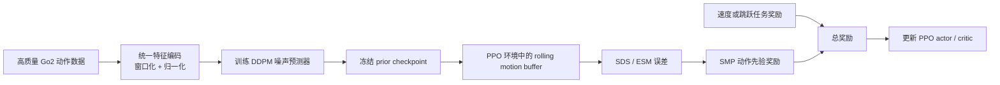

# SMP：在 Nazarite-mjlab 中接入四足动作先验

本文给出在当前 `Nazarite-mjlab` 中实现 Score-Matching Motion Prior（SMP）的实际路线。目标不是立刻复现所有 SMP 论文实验，而是先为 Go2 平地速度任务建立一个可验证的动作先验，再逐步扩展到 WTW、跳跃和恢复。

本文以当前项目源码为准：

```text
Train/Nazarite/Nazarite-src/nazarite/
├── config/train_config/base_env_cfg.py
├── config/train_config/env_cfgs/go2_env_cfgs.py
├── config/robot_config/go2_cfg.py
├── mdp/
└── __init__.py
```

SMP 的论文原理是：先使用高质量动作数据训练一个扩散模型；之后冻结该模型，用它对 RL 当前生成的动作窗口评分。策略同时获得任务奖励和“动作像不像高质量数据”的先验奖励。



关键边界：**PPO 更新策略网络，绝不更新扩散模型。**

---

## 1. 先确定第一阶段的范围

第一阶段只新增一个任务，例如：

```text
Nazarite-Velocity-Flat-Go2-SMP
```

它应当从现有的 `Nazarite-Velocity-Flat-Go2` baseline 派生，保留原本的：

- Go2 机器人、PD 关节位置动作和物理参数；
- 速度命令与 Grid Adaptive 课程；
- 速度跟踪、姿态、足端滑移、关节限位等原有奖励；
- 现有的跌倒和非法接触终止条件。

第一阶段新增的只有：

1. 冻结的 Go2 动作扩散模型；
2. 10 帧滚动动作特征缓存；
3. SDS / Ensemble Score Matching 奖励项；
4. 日志与验证测试。

不要在第一版同时做下面的事情：

- 不要直接替换 WTW 的 phase reward；
- 不要直接接入跳跃状态机；
- 不要同时做 GSI（Generative State Initialization）；
- 不要把所有步态、跳跃、恢复塞进一个很大的 prior；
- 不要一开始改 PPO 超参数。

原因是 SMP 依赖三个系统同时正确：动作数据、特征坐标系和奖励尺度。一次引入太多新变量时，训练失败无法定位原因。

---

## 2. 先理解当前 Nazarite 需要复用什么

当前项目已经实现 SMP 所需的大部分 RL 基础设施。

| 当前模块 | SMP 如何使用 |
| --- | --- |
| `ManagerBasedRlEnvCfg` | 将 prior 初始化、buffer reset、SMP reward 注册为 event / reward term。 |
| `EventTermCfg` | 在 `startup` 加载冻结模型，在 `reset` 重置动作窗口。 |
| `RewardTermCfg` | 将 SMP 作为独立奖励项加入现有 reward manager。 |
| Go2 的 root/joint/body 数据 | 在线构造 prior 所需的动作特征。 |
| RSL-RL PPO | 无需修改；它只消费总 reward。 |
| Go2 足端 site 与接触传感器 | 导出动作数据、构造足端位置特征、评估效果。 |

应该重点阅读以下代码：

```text
nazarite/__init__.py
    任务注册；新增 SMP 任务最终也在这里注册。

nazarite/config/train_config/base_env_cfg.py
    基础 event、observation、reward 和 termination 的组装位置。

nazarite/config/train_config/env_cfgs/go2_env_cfgs.py
    Go2 实体、四个足端 site、接触传感器及速度任务的任务特化配置。

nazarite/config/robot_config/go2_cfg.py
    Go2 关节、执行器、默认 root / joint state 的定义。

smp-master/src/smp/rl/events.py
    G1 示例中 prior 的加载、GSI 和 reset buffer 的写法。

smp-master/src/smp/rl/rewards.py
    SDS、三 timestep ensemble 和每 timestep 误差归一化。
```

当前任务的基准命令：

```bash
cd Train/Nazarite
uv run train Nazarite-Velocity-Flat-Go2
```

开始 SMP 前，先确保 baseline 能稳定完成命令跟踪。没有可信 baseline 时，用其 rollout 训练出的 prior 也不可信。

---

## 3. 四足 SMP 的动作特征设计

### 3.1 第一版建议的 39 维特征

Go2 有 12 个可控关节、4 个足端。建议先使用下列每帧特征：

```text
root_pos_local       3
root_rot_6d          6
joint_pos           12
foot_pos_local      12     # 4 feet x xyz
root_lin_vel_local   3
root_ang_vel_local   3
--------------------------------
total               39
```

这里的 `root` 是 Go2 base / trunk 对应的浮动根，不是世界原点。

不建议第一版加入：

- command：它属于下游任务条件，不是动作自然度；
- action：动作尺度、控制频率和 PD 参数改变时很难保持可复用；
- 接触 bool：离散信号的加噪和归一化更复杂，先以足端轨迹表达步态；
- WTW phase：这是人为指定的期望时序，不是从数据中学到的动作先验。

### 3.2 统一参考坐标系

每个窗口长度设为 `W=10`。第 `T` 帧是窗口最后一帧。所有空间量写入以最后帧机身 yaw 为朝向、最后帧 root xy 为原点的局部坐标系：

```text
root_pos_local[t] = inv(yaw_T) * (root_pos[t] - root_pos[T])
root_pos_local[t].z = root_pos[t].z

root_rot_6d[t] = rot6d(inv(yaw_T) * root_quat[t])

foot_pos_local[t] = inv(yaw_T) * (foot_pos[t] - root_pos[t])

root_lin_vel_local[t] = inv(yaw_T) * root_lin_vel_world[t]
root_ang_vel_local[t] = inv(yaw_T) * root_ang_vel_world[t]
```

这样做保证同一段 trot 即使发生在不同环境格子、不同世界朝向，输入 prior 后仍然相同。

### 3.3 最重要的约束：离线与在线必须一致

离线数据导出和 PPO 环境内实时计算必须调用同一份特征函数。建议建立：

```text
nazarite/config/train_config/train_algorithm/smp/prior/features.py
```

其中只放纯 Tensor 函数，例如：

```python
def encode_motion_window(
    root_pos_w,
    root_quat_w,
    root_lin_vel_w,
    root_ang_vel_w,
    foot_pos_w,
    joint_pos,
) -> Tensor:
    """输入 (N, W, ...)；输出 (N, W, 39)。"""
```

离线导出器和在线 `MotionFeatureBuffer.compute_features()` 都调用它。不要分别写两套“看起来相同”的坐标变换。

必须写一个测试：拿同一段仿真轨迹，同时经过离线和在线路径编码，检查：

```text
shape 相同
feature 顺序相同
max_abs_error < 1e-5
```

没有通过这个测试时，禁止训练 diffusion 或 PPO。

---

## 4. 动作数据的准备策略

### 4.0 使用 3DDogs-Lab 的第一步：审计 Optical MoCap

本项目本地的 3DDogs 数据集中，SMP 重定向应使用真实三维光学动作捕捉文件，而不是 RGBD 视频或 Wild 图像：

```text
/home/haozi/3DDogs/3DDogs2024_full/Data/Optical/
  Sync_Align_v2023_11_16b/
    optical_sync_align_d*_t*_*.txt
```

每个文件的前四行描述采样率和 marker 名称；之后每行是一帧，格式为 `frame_num + 每个 marker 的 xyz`。数据为 60 Hz，关键 marker 包括 `withers`、`sacrum`、左右肩/髋和四个掌/跖端点。缺失点为 `NaN`，不得静默当作零坐标使用。

先运行项目提供的只读检查器：

```bash
cd Train/Nazarite
uv run python tools/smp_tools/inspect_3ddogs.py \
  --input /home/haozi/3DDogs/3DDogs2024_full/Data/Optical/Sync_Align_v2023_11_16b/optical_sync_align_d19_t1_a.txt \
  --output-dir output/3ddogs_inspect/d19_t1_a \
  --plot
```

该工具会产生：

```text
retarget_inputs_raw.npz  # raw marker、trunk、四爪和 valid_mask
summary.json             # fps、marker、连续有效区间等审计结果
raw_trajectories.png     # 可选的原始 3D 轨迹图
```

四爪顺序固定为 `[FL, FR, RL, RR]`，对应 marker 为 `[l_meta_carp, r_meta_carp, l_meta_tars, r_meta_tars]`。工具故意不做坐标变换：先在图中确认原始前进、左右与竖直方向；随后才为 MuJoCo 定义保持右手系的 `3DDogs y-up -> MuJoCo z-up` 变换。

### 4.1 数据质量决定 prior 上限

SMP 只会偏好它见过的动作分布。若数据中有抖动、足端拖地、频繁跌倒，prior 会把这些也当成合理行为。

数据来源优先级：

1. 实机日志或高质量优化 / 重定向轨迹；
2. 已稳定收敛的 Go2 PPO 策略 rollout；
3. 多个高质量 checkpoint 的 rollout 混合；
4. 不建议使用训练早期、随机策略或失败 episode。

第一版可从现有稳定的平地速度 checkpoint 采样数据。至少覆盖：

```text
前进、后退、低速、正常速度、转向、随机扰动后的恢复
```

如果之后想让 SMP 帮助跳跃，训练 prior 的数据中必须包含高质量的蹲伏、起跳、腾空、落地和恢复片段。纯 locomotion prior 不会自动成为跳跃 prior。

### 4.2 建议的数据格式

每帧保存原始物理量，而不是先保存 39 维特征：

```text
root_pos_w       (3)
root_quat_w      (4, wxyz)
root_lin_vel_w   (3)
root_ang_vel_w   (3)
joint_pos        (12)
foot_pos_w       (4, 3)
metadata: dt、robot model、joint order、foot order、command、episode id
```

随后由离线脚本统一编码、切窗。好处是未来修改特征定义时不必重新采集 rollout。

关节与足端顺序必须显式固化。例如：

```text
joint order: XML / Entity 的 12 joint order
foot order:  [FL, FR, RL, RR]
```

在 checkpoint 中保存这个元数据；只保存权重是不够的。

### 4.3 窗口和归一化

建议起点：

```text
control frequency: 当前环境的 step_dt
window size:       10
stride:            1
normalization:     每个 feature 使用 q01 / q99 映射到 [-1, 1]
```

归一化统计应使用覆盖面较宽的数据，而不是只用单一速度 trot。否则 PPO 探索到稍偏离数据分布的状态时，特征容易落在极端范围，score 会不可靠。

归一化公式：

\[
x_{norm}=2\frac{x-q_{01}}{q_{99}-q_{01}+\epsilon}-1
\]

必须把 `q_low/q_high` 和模型结构一起保存进 checkpoint；RL 阶段不能重新计算。

---

## 5. 训练四足动作扩散模型

### 5.1 最小模型

第一版可以沿用 `smp-master` 的轻量 Transformer / DiT 思路：

```text
input:       (B, 10, 39)
diffusion:   50 timesteps, cosine beta schedule
model:       d_model=128 或 256，2 个 Transformer block，4 heads
output:      predicted epsilon, shape (B, 10, 39)
```

训练过程：

```python
x0 = normalized_motion_window
t = random_int(0, 49)
eps = randn_like(x0)
xt = scheduler.add_noise(x0, eps, t)
eps_hat = denoiser(xt, t)
loss = l1_loss(eps_hat, eps)  # 或 mse_loss；需固定一种并记录
```

在训练时，模型是在学习“给定带噪动作和噪声等级，真实动作应该往哪个方向去噪”。这就是后续能用误差作为动作自然度信号的原因。

### 5.2 训练前的检查

训练前打印并保存：

```text
window count
feature dim = 39
window size = 10
每个 feature 的 q01 / q99
joint / foot order
dt 与原始数据频率
```

如果根高度、关节角或速度的量纲明显不对，先修数据。不要指望 DDPM 自动吸收错误单位。

### 5.3 prior 本身的验收

验证集 loss 下降不是充分条件。额外构造三类窗口：

| 窗口 | 预期 SDS error |
| --- | --- |
| 正常速度步态 | 低 |
| 将时间帧随机打乱 | 高 |
| 从正常窗口随机扰动大量关节 | 高 |
| 明显倾倒 / 足端滑移片段 | 高 |

如果正常窗口与损坏窗口没有稳定间隔，不要进入 RL 阶段。先检查特征、数据覆盖和模型训练。

项目中的正式验收命令如下。`--strict` 会在任一验收条件失败时返回非零
退出码，适合训练脚本或 CI 阻止错误 checkpoint 进入 PPO：

```bash
cd /home/haozi/桌面/Nazarite-mjlab/Train/Nazarite

uv run python tools/smp_tools/prior/validate_prior.py \
  --checkpoint tools/smp_dataset/smp_prior/go2_3ddogs_1x/pretrained.pt \
  --data-dir tools/smp_dataset/3ddogs_go2_1x/processed/motion_windows \
  --output-dir output/smp_1x/prior/go2_3ddogs_1x/validation \
  --device cuda:0 \
  --num-eval-windows 512 \
  --num-generated 256 \
  --batch-size 128 \
  --noise-repeats 4 \
  --strict
```

输出包括 `prior_validation.json` 和 `generated_windows.npz`。验收同时检查：

- 时间打乱和关节扰动的去噪误差是否高于正常窗口；
- DDPM 生成值是否有限、是否严重越过训练分布；
- 生成 root 高度和 6D 旋转是否合法；
- 12 个 Go2 关节是否越过 XML 硬限位；
- 最后一帧能否成功执行 MuJoCo FK。

---

## 6. 在 Nazarite 中实现 frozen-prior 服务

建议新增如下文件：

```text
nazarite/config/train_config/train_algorithm/smp/prior/
├── __init__.py
├── features.py        # 39 维特征和 MotionFeatureBuffer
├── model.py           # DiffusionDenoiser
├── scheduler.py       # DDPM 加噪 / 采样
├── checkpoint.py      # load_denoiser，读取 model + stats + metadata
├── events.py          # startup / reset event
└── rewards.py         # smp_guidance_reward
```

### 6.1 Startup event

`startup` event 完成以下事情：

```text
加载 checkpoint
创建 denoiser 并 load_state_dict
model.eval()
model.requires_grad_(False)
创建 scheduler
复制 q_low/q_high 到 GPU
查找 Go2 四个足端对应的 body 或 site index
分配 shape=(num_envs, 10, ...) 的 rolling buffer
创建每个 diffusion timestep 的误差归一化器
```

模型推理必须使用：

```python
with torch.no_grad():
    eps_hat = model(x_t, t)
```

建议先不使用 `torch.compile`。等小规模 smoke test 稳定后，再考虑编译来降低 4096 环境下的开销。

### 6.2 Rolling buffer

每个 environment 必须有独立的最近 10 帧历史。每次仿真 step：

```text
buffer[:, 0:9] <- buffer[:, 1:10]
buffer[:, 9]   <- 当前 root / joint / foot 运动状态
```

然后将 raw state 送入统一的 `encode_motion_window()`，得到 `(num_envs, 10, 39)`。

不要把 actor 的 observation history 当成 SMP buffer。两者用途不同：

- actor history 可以含噪声、裁剪、命令、phase 和上一次 action；
- SMP buffer 必须是干净、物理坐标一致、与离线数据同定义的运动状态。

### 6.3 Reset 处理

第一版不做 GSI 时，普通 reset 后会只有一帧真实状态。为了避免前 9 帧全零导致 prior 误判，建议将 reset 后状态复制填满 10 帧：

```python
buffer.reset(env_ids, current_state.repeat(1, window_size, 1))
```

这不是自然运动，但只影响每个 episode 的最初 10 个控制步。更稳妥的做法是给前 `window_size - 1` 步设置 `smp_warmup_mask=0`，不加入 SMP 奖励；从第 10 步开始启用。

之后实现 GSI 时，才改为“采样完整 prior 窗口、写入最后帧到仿真、整段窗口写入 buffer”。

---

## 7. SDS / ESM 奖励的实现

### 7.1 单个时间步

对当前动作窗口 `x0`：

\[
x_t=\sqrt{\bar\alpha_t}x_0+\sqrt{1-\bar\alpha_t}\epsilon
\]

\[
e_t=\operatorname{mean}((\hat\epsilon_\theta(x_t,t)-\epsilon)^2)
\]

其中 mean 只在窗口维和 feature 维平均，保留环境维度：`shape=(num_envs,)`。

### 7.2 Ensemble Score Matching

不要每一步随机选择一个 timestep。第一版使用固定集合：

```text
K = (8, 15, 22)
```

对三个噪声等级各计算一次误差并取均值：

\[
e=\frac{1}{|K|}\sum_{t\in K}e_t
\]

固定 ensemble 的意义是降低奖励随机性。PPO 对每步 reward 的方差很敏感。

### 7.3 每 timestep 自适应归一化

不同 diffusion timestep 的 MSE 数值通常不在同一尺度。维护每个 `t` 的运行均值：

\[
\tilde e_t=\frac{e_t}{\operatorname{runningMean}(e_t)+\epsilon}
\]

然后计算：

\[
r_{smp}=\exp(-w_s\cdot\operatorname{mean}(\tilde e_t))
\]

推荐从 `w_s=2` 或 `4` 开始。实现时还应记录 raw MSE，不能只记录归一化后 reward。

建议奖励函数接口：

```python
def smp_guidance_reward(
    env: ManagerBasedRlEnv,
    fixed_timesteps: tuple[int, ...] = (8, 15, 22),
    ws: float = 4.0,
    warmup_steps: int = 9,
) -> Tensor:
    """返回每个环境的 r_smp，范围约为 (0, 1]。"""
```

---

## 8. 第一次接入奖励时使用加法，而不是乘法

当前 Nazarite 的 RewardManager 把多个奖励项加总。第一版配置应当是：

```python
cfg.rewards["smp_guidance"] = RewardTermCfg(
    func=smp_guidance_reward,
    weight=0.2,
    params={"ws": 4.0, "fixed_timesteps": (8, 15, 22)},
)
```

即：

\[
r=r_{existing}+\lambda_{smp}r_{smp}
\]

这里的 `weight=0.2` 只是起始实验值，必须根据日志调整。它的目标是辅助现有速度奖励，而不是替代它。

不要直接复制 G1 仓库的乘法：

\[
r=r_{task}\cdot r_{smp}
\]

因为当前速度和跳跃任务的总 reward 包含正奖励与负代价。整体相乘会改变负项符号、缩小正负比例，并让已有调参失效。

如果以后要测试乘法门控，先单独定义严格非负的：

```text
task_quality = velocity_tracking_quality 或 jump_phase_success_quality
```

再写一个专用的复合 reward，不要把 RewardManager 的全部结果相乘。

---

## 9. 新任务配置的落点

建议新建：

```text
nazarite/config/train_config/env_cfgs/go2_smp_env_cfg.py
```

它从现有速度任务创建配置：

```python
def Nazarite_Velocity_Flat_Go2_SMP(play: bool = False) -> ManagerBasedRlEnvCfg:
    cfg = Nazarite_Velocity_Flat_Go2_No_WTW(play=play)

    cfg.events["init_smp"] = EventTermCfg(
        func=init_smp_state,
        mode="startup",
        params={"ckpt_path": "datasets/smp/go2_locomotion.pt"},
    )
    cfg.events["reset_smp_buffer"] = EventTermCfg(
        func=reset_smp_buffer,
        mode="reset",
        params={},
    )
    cfg.rewards["smp_guidance"] = RewardTermCfg(
        func=smp_guidance_reward,
        weight=0.2,
        params={"ws": 4.0, "fixed_timesteps": (8, 15, 22)},
    )
    return cfg
```

然后在 `nazarite/__init__.py` 注册：

```python
register_mjlab_task(
    task_id="Nazarite-Velocity-Flat-Go2-SMP",
    env_cfg=Nazarite_Velocity_Flat_Go2_SMP(),
    play_env_cfg=Nazarite_Velocity_Flat_Go2_SMP(play=True),
    rl_cfg=unitree_go2_normal_ppo_runner_cfg(
        experiment_name="go2_flat_smp",
    ),
    runner_cls=VelocityOnPolicyRunner,
)
```

`reset_smp_buffer` 必须排在现有 root / joint reset 之后。实现时写一个小测试确认 event 执行顺序和 reset 后的 buffer 内容。

---

## 10. 分阶段验收标准

每完成一个阶段都要停下来验证；不要一次性写完整管线。

| 阶段 | 要完成的内容 | 通过标准 |
| --- | --- | --- |
| A | 导出原始 Go2 rollout | root、joint、四足位置无 NaN；元数据完整。 |
| B | 实现 39 维窗口编码 | 离线与在线特征误差 `< 1e-5`。 |
| C | 训练 DDPM prior | validation loss 稳定下降。 |
| D | prior 判别测试 | 正常动作的 raw MSE 低于损坏动作。 |
| E | 环境 smoke test | 16 环境、1000 steps、无 NaN、prior 无梯度。 |
| F | 小规模 PPO | 256 环境能保持现有速度任务不崩溃。 |
| G | 完整 A/B 实验 | 不降低速度误差，同时改善至少一个动作质量指标。 |

建议记录：

```text
smp/raw_mse_t8
smp/raw_mse_t15
smp/raw_mse_t22
smp/normalized_error
smp/reward
task/velocity_error
task/fall_rate
task/foot_slip
task/illegal_contact
task/action_rate
```

比较实验至少包括：

```text
baseline:  Nazarite-Velocity-Flat-Go2
SMP:       相同 seed、相同 PPO 参数、仅新增 smp_guidance
```

不要只比较训练总 reward，因为新加 reward 后总 reward 没有可比性。

---

## 11. 常见失败模式与定位顺序

### 11.1 PPO 一开始就不学习

检查顺序：

1. `smp/reward` 是否几乎总是 0；
2. `smp/raw_mse` 是否为 NaN / Inf；
3. q01/q99 是否有极小 span；
4. online feature 是否与离线 feature 一致；
5. SMP weight 是否太大；
6. warmup 前是否错误使用了空 buffer。

先把 SMP reward weight 设为 `0`，确认任务能复现 baseline；再逐步提高。

### 11.2 prior 认为跌倒动作也很自然

可能原因：

- 数据集混入失败 episode；
- prior 数据只有低速站立，无法区分异常运动；
- 特征缺少 root 高度或 root rotation；
- 训练数据与 online 坐标系不一致。

不要靠把 `w_s` 调大解决。那只会让错误评分更强。

### 11.3 策略站得更稳但不愿移动

这通常意味着 prior 比任务奖励强。减小 SMP weight，或增加高速度动作在 prior 数据中的覆盖。也需要检查数据里是否过度包含站立片段。

### 11.4 策略为了速度奖励变得异常，但 SMP 没有阻止

优先检查：

- 数据是否覆盖该速度范围；
- raw MSE 在异常片段是否确实变大；
- `smp/reward` 是否被 running mean 归一化得过平；
- window 是否太短，无法观察到一个完整运动变化。

### 11.5 GPU 吞吐显著下降

SMP 每个 RL step 额外做三次 denoiser 推理。优化顺序：

1. 先确保全部 Tensor 都在 GPU，避免 CPU / GPU copy；
2. 合并三个 timestep 的 batch 调用，而不是 Python 循环调用三次；
3. 再尝试 `torch.compile`；
4. 最后才考虑减少模型宽度、时间步数或 reward 计算频率。

不要为追求吞吐先改成随机单 timestep；那会明显提高 reward 方差。

---

## 12. GSI、WTW、跳跃的后续扩展

### 12.1 GSI

当 SMP reward-only 版本稳定后，才实现 GSI：

```text
随机高斯窗口
  -> DDPM 完整反向采样
  -> 反归一化到物理特征
  -> 用最后一帧设置 Go2 root / joints
  -> 用全窗口填满 SMP buffer
```

GSI 最适合恢复和跳跃，因为普通站立 reset 很难覆盖腾空、受扰或倾倒附近状态。必须额外验证生成窗口是否能映射到物理可行状态，不能只看扩散 loss。

### 12.2 WTW

WTW 指定 gait 与 phase，SMP 学习数据自然性。两者可互补：

```text
WTW：希望机器人以指定相位完成动作。
SMP：希望该动作整体像高质量四足运动。
```

但不要一开始接入，因为二者都可能影响足端时序。先确认 SMP 在 baseline 速度任务有效，再对 WTW 进行单独 A/B。

### 12.3 跳跃与恢复

推荐两类 prior，而不是一个混合 prior：

```text
go2_locomotion.pt  : 行走、跑步、转向、扰动恢复
go2_jump.pt        : 蹲伏、起跳、腾空、落地、回站
```

跳跃任务使用 locomotion prior 往往会压制起跳；反之跳跃 prior 用在普通速度任务上也可能产生不必要的动作偏好。后续可以再研究 style composition 或 conditional diffusion。

---

## 13. 推荐的实际执行清单

截至当前实现，正式任务名为 `Nazarite-SMP-Forward-Go2`，核心代码位于
`nazarite/config/train_config/train_algorithm/smp/prior/`。3DDogs 1 倍速数据已被编码为 50 Hz、10 帧、39 维
窗口；当前小数据集共有 737 个窗口。下面的训练命令使用与参考仓库一致的
DiT 规模和扩散训练参数，并把最终 checkpoint 同时导出到下游任务的默认位置：

```bash
cd /home/haozi/桌面/Nazarite-mjlab/Train/Nazarite

uv run smp-pretrain \
  --data-dir tools/smp_dataset/3ddogs_go2_1x/processed/motion_windows \
  --norm-stats tools/smp_dataset/3ddogs_go2_1x/statistics/norm_stats.npz \
  --name go2_3ddogs_1x \
  --device cuda:0 \
  --d-model 256 \
  --nhead 4 \
  --num-layers 2 \
  --num-timesteps 50 \
  --num-noise-samples 10 \
  --batch-size 1024 \
  --num-epochs 2000
```

正式 prior 通过生成动作和损坏样本区分测试后，再启动下游 SMP PPO：

```bash
uv run train Nazarite-SMP-Forward-Go2 \
  --gpu-ids '[0]' \
  --env.scene.num-envs 512 \
  --agent.max-iterations 30000 \
  --agent.num-steps-per-env 24 \
  --agent.logger wandb
```

训练日志中除 PPO 指标外，还会记录 `smp_raw_error`、
`smp_guidance_reward` 和 `smp_task_reward`。5 epoch 的小模型只用于验证
checkpoint 加载和推理，生成状态并不物理可行，不得用于正式 PPO。

```text
[x] 完成 3DDogs -> Go2 重定向和 1 倍速 50 Hz 动作窗口
[x] 定义并测试统一的 39 维离线 / 在线 feature codec
[x] 计算全数据 q01/q99
[x] 实现 DiT、cosine DDPM、checkpoint 和训练入口
[x] 实现 frozen prior、三 timestep SDS reward 和训练指标
[x] 实现 GSI reset / refresh，并注册 Nazarite-SMP-Forward-Go2
[ ] 扩充当前仅 737 窗口、18.1 秒的动作数据
[ ] 训练并保存正式 go2_3ddogs_1x prior checkpoint
[ ] 写 prior 正常/损坏动作判别测试
[ ] 先做 16 / 256 环境 smoke run
[ ] 做 baseline 与 SMP 的完整 A/B 实验
[ ] 结果稳定后再接入 WTW、跳跃或恢复
```

最小可行版本的成功定义不是“看起来更自然”，而是：**同样的速度命令和随机化条件下，速度跟踪不下降，且跌倒率、足端滑移、非法接触、关节加速度或动作抖动中至少一项有可重复改善。**
