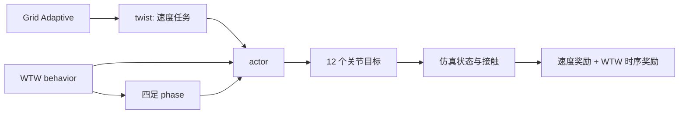

# WTW：从零手写 Walk These Ways

> 本文以当前 Nazarite-mjlab 源码为准。当前默认任务是平地单一 Trot：Grid Adaptive 管速度难度，WTW 管步态时序和行为风格。历史实验中的 Pronking 结论仅作参考，不是当前默认配置。

## 1. 当前任务与文件入口

已注册任务：

| 任务 | 作用 |
|---|---|
| `Nazarite-Velocity-Flat-Go2` | 不含 WTW 的 Grid Adaptive baseline。 |
| `Nazarite-Velocity-Flat-Go2-WTW` | 当前 WTW 平地 Trot 任务。 |

关键文件：

```text
Train/Nazarite/Nazarite-src/nazarite/
├── mdp/wtw.py                         # behavior、gait 模板、phase、网页行为控制
├── mdp/wtw_rewards.py                 # phase-conditioned WTW 奖励与日志
├── mdp/commands.py                    # Grid Adaptive 与 gait-aware 成功判定
├── config/train_config/base_env_cfg.py # WTW 默认 Grid、观测历史、奖励组合
├── config/train_config/env_cfgs/go2_env_cfgs.py # Go2 传感器、终止条件、play 设置
└── __init__.py                        # 任务 ID 注册
```

当前默认训练配置位于 `base_env_cfg.py` 的 `_make_wtw_velocity_command()` 与 `_make_wtw_behavior_command()`：

```python
# 速度课程
lin_vel_x = (-1.0, 1.0)
lin_vel_y = (0.0, 0.0)
ang_vel_z = (0.0, 0.0)
grid_num_x = 3
grid_num_yaw = 1
initial_cell = (1, 0)
require_all_active_cells_ready = True

# Trot 行为
gait_names = ("trot",)
frequency_range = (2.0, 2.4)
body_height_range = (0.0, 0.0)
body_pitch_range = (0.0, 0.0)
stance_width_range = (0.25, 0.25)
foot_swing_height_range = (0.06, 0.06)
duty_factor = 0.5
randomize_initial_phase = False
```

这里 `body_height=0.0` 是相对于基础目标高度 `0.32 m` 的偏移，即绝对目标为 `0.32 m`。

## 2. WTW 解决的问题

普通速度策略只知道任务速度：

```text
a_t = π(proprioception_t, twist_t)
```

同样的 `1 m/s` 可以由小碎步、Trot、Bound 等多种动作完成。只用速度奖励时，策略没有理由保持某一种指定步态。

WTW 额外输入行为与相位：

```text
a_t = π(proprioception_t, twist_t, behavior_t, phase_t)
```

- `twist=[vx, vy, wz]`：走多快、往哪里走；
- `behavior`：想要的 gait、步频、机体风格；
- `phase`：该 gait 此刻走到周期的哪个位置。

这三者的分工不可混淆：Grid Adaptive 只决定“训练哪段速度”；WTW 只决定“以什么相位结构和风格完成该速度”。



## 3. 八维 behavior 与 gait 模板

行为向量顺序固定，训练、导出和实机部署都必须一致：

```text
[theta1, theta2, theta3, frequency,
 body_height_offset, body_pitch, stance_width, foot_swing_height]
```

| 维度 | 意义 | 当前 Trot 值/范围 |
|---|---|---|
| `theta1..3` | 定义腿间相对 phase 偏移 | `trot=(0.5, 0, 0)` |
| `frequency` | phase 每秒推进的完整周期数 | `2.0–2.4 Hz` |
| `body_height_offset` | 相对 0.32 m 的高度偏移 | `0.0 m` |
| `body_pitch` | 目标俯仰 | `0 rad` |
| `stance_width` | 名义站宽 | `0.25 m` |
| `foot_swing_height` | 摆动中点目标抬脚高度 | `0.06 m` |

内置的对称 gait 模板为：

```python
GAIT_THETA = {
    "pronking": (0.0, 0.0, 0.0),
    "trot": (0.5, 0.0, 0.0),
    "bounding": (0.0, 0.5, 0.0),
    "pacing": (0.0, 0.0, 0.5),
}
```

腿顺序恒为 `[FL, FR, RL, RR]`。Trot 经 `_theta_to_phase_offsets()` 转换后，FL 与 RR 为一组，FR 与 RL 为另一组，两组相差半个周期。若 foot site、传感器或这个顺序不一致，常见症状就是前后腿朝相反方向撇、时序奖励无法下降。

## 4. phase 如何工作

`_base_phase ∈ [0, 1)` 是每个环境的公共时钟。腿相位由：

```text
phase_leg = (base_phase + phase_offset_leg) mod 1
base_phase_next = (base_phase + frequency × dt) mod 1
```

`duty_factor=0.5` 规定每条腿的 phase 前半周期是期望支撑，后半周期是期望摆动。`phase` 不是接触传感器值，而是**期望接触的时间参考**；真实接触仍由物理仿真产生，奖励负责比较两者。

当前工程实现有一个刻意的站立规则：

```text
norm([vx, vy]) + abs(wz) <= 0.05  -> 冻结 phase
否则                            -> 推进 phase
```

因此零速度命令是站立而不是原地跑步，避免策略在没有运动任务时继续小碎步。该策略与 WTW 官方仓库的 phase 生命周期不完全相同，做论文复现比较时应明确记录。

actor 不直接接收裸 phase，而接收每条腿的 `sin(2πphase)` 与 `cos(2πphase)`，共 8 维。这避免 phase 从 `1` 回到 `0` 时输入不连续，也能区分只用 `sin` 会混淆的两个相位位置。

## 5. 观测、历史与部署边界

WTW actor 使用的量全部可以由实机本体感知与部署端命令生成：IMU 角速度/重力投影、编码器关节位置和速度、上一动作、`twist`、`behavior`、`phase`。

| 部分 | 历史长度 | 原因 |
|---|---:|---|
| actor 普通本体项 | 10 帧 | 提供短时间运动上下文。 |
| actor behavior | 5 帧 | 行为变化慢，保留切换趋势。 |
| actor phase sin/cos | 当前帧 | sin/cos 已完整表达周期位置，不再堆叠。 |
| critic 普通/特权项 | 3 帧 | 训练价值估计使用较短历史。 |
| critic behavior / phase | 5 / 当前帧 | 与 actor 语义一致。 |

critic 还会看到线速度、机体高度、足端高度、接触、接触力等 privileged 信息。这些量不在 actor 输入中；导出实机策略时只需实现 actor 所需的本体观测和命令生成器。

## 6. 当前奖励组合

WTW 不再使用旧的 `wtw_combined`。每项独立注册到 `RewardManager`，便于看清行为质量与速度任务是否冲突。

| 奖励项 | 权重 | 作用 |
|---|---:|---|
| `track_linear_velocity` / `track_angular_velocity` | `+2.0` / `+2.0` | 主任务速度跟踪。 |
| `wtw_swing_phase_force` | `-4.0` | 摆动腿少受力。 |
| `wtw_stance_phase_velocity` | `-4.0` | 支撑腿少滑动。 |
| `wtw_contact_schedule` | `-1.5` | 实际四足接触向量匹配当前 gait。 |
| `wtw_group_contact_consistency` | `-0.5` | 只对同步 gait 生效；Trot 下自然为零。 |
| `wtw_body_height` | `+40.0` | 跟踪 `0.32 + offset`。 |
| `wtw_body_pitch` | `+0.10` | 跟踪 pitch 行为命令。 |
| `wtw_foot_clearance` | `-30.0` | 摆动相连续 `0 → 峰值 → 0` 高度轨迹。 |
| `wtw_raibert_foot_position` | `-10.0` | 基于速度、phase 的四足落点代价。 |
| `wtw_shank_contact` | `-0.1` | 小腿触地软惩罚。 |

`air_time`、`prolonged_air_time`、`stance_contact` 已从 WTW 任务移除，因为它们不读 phase，可能与指定摆动/支撑时序相互竞争。`pose` 在 WTW 中权重为 0；baseline 的固定 `base_height` 奖励也会被移除。

## 7. Grid Adaptive 与 gait-aware 成功判定

当前 WTW Grid 是一维 x 速度的三格课程：

```text
cell 0: [-1.000, -0.333] m/s
cell 1: [-0.333,  0.333] m/s   <- 初始 cell
cell 2: [ 0.333,  1.000] m/s
```

一个 cell 要继续扩展，除了访问量和成功率外，一个命令段还要同时满足：

```text
平均速度误差 <= 0.25 m/s
平均 yaw 误差 <= 0.10 rad/s
平均接触时序误差 <= 0.16
```

`require_all_active_cells_ready=True` 会形成严格 frontier：新 cell 未完成 `8192` 次访问且近期成功率未达到 `0.8` 前，已有 cell 不会继续扩展。这样可以避免大规模并行训练把全部速度范围一次打开。

Trot 不是同步 gait，所以 `grid_gait_sync_error` 与 `grid_gait_mixed_contact` 在本任务通常为零；不要用它们评价 Trot 是否学会。应看 `grid_gait_schedule_error`、四脚 schedule error 与速度误差。

## 8. 训练、播放与网页行为覆盖

```bash
cd /home/haozi/桌面/Nazarite-mjlab/Train/Nazarite
uv run train Nazarite-Velocity-Flat-Go2-WTW

uv run play Nazarite-Velocity-Flat-Go2-WTW \
  --checkpoint_file logs/rsl_rl/go2_flat_wtw_independent/<run>/model_2400.pt
```

若未传 `--checkpoint_file`，`play` 需要提供 `wandb_run_path`。播放时 WTW 保留 `push_robot`，用于训练后单独观察抗扰动能力；训练本身会关闭该随机推力，避免早期 gait 学习被扰动掩盖。

网页 `Commands` 下有两个面板：

1. `Twist`：覆盖当前选中环境的速度指令；
2. `Behavior`：打开 `Enable override` 后覆盖当前选中环境的 WTW 行为。

`Behavior` 可修改当前配置已经训练过的 gait，以及 Frequency、Body height offset、Body pitch、Stance width、Foot swing height。覆盖每个仿真步都会重写，故不会被 30 秒行为重采样覆盖。`Reset phase` 从 phase=0 重新开始；`Use training defaults` 将控件恢复为训练范围中点并开启覆盖。

该面板用于诊断和展示，不会让一个只训练 Trot 的 checkpoint 获得 Pronking/Bound/Pace 能力，也不改变训练时的参数分布。`duty_factor` 是当前全局时序形状，不是 8 维 behavior 输入，暂不在网页中逐环境修改。

## 9. 近期训练结果如何解读

`2026-08-30_19-18-04` 是一次历史宽频实验，快照实际为 `frequency_range=(2.0, 3.0)`；它不是当前默认的 `2.0–2.4 Hz`。其后期表现：3 个 cell 均激活、最近 Grid 成功率约 94%、接触时序误差约 0.122，说明 Trot 能承受一定频率变化。

但该运行的平均高度约 `0.343 m`，高于 `0.32 m` 目标约 `0.023 m`；与此前固定 `2 Hz` 的约 `0.319 m` 相比，出现了明确的上漂。因此下一轮先用当前较窄的 `2.0–2.4 Hz` 验证，而不是直接扩大到 3 Hz 以上。

分析任何历史 run 时，以该 run 的 `params/env.yaml` 为准，而不是以现在源码的默认值倒推。

## 10. 下一步扩展原则

1. 先固定 gait=Trot，仅验证 `2.0–2.4 Hz`；
2. 用网页 Behavior 面板在已训练范围内扫频，并观察高度上漂、步态切换和抗推；
3. 若高度偏置持续存在，先单独调整高度目标/权重或频率范围，不要同时改接触奖励；
4. Trot 稳定后再单独开放一个行为维度；
5. 要训练新的 gait 时，先建立独立单 gait 任务与验收指标，再考虑一个多 gait 条件策略。

关于奖励的逐项含义和调参顺序，见 [WTW 奖励调参详细使用指南](WTW奖励调参详细使用指南.md)；关于从 phase 设计 gait，见 [WTW 步态行为设计教程](WTW-步态行为设计教程.md)。
